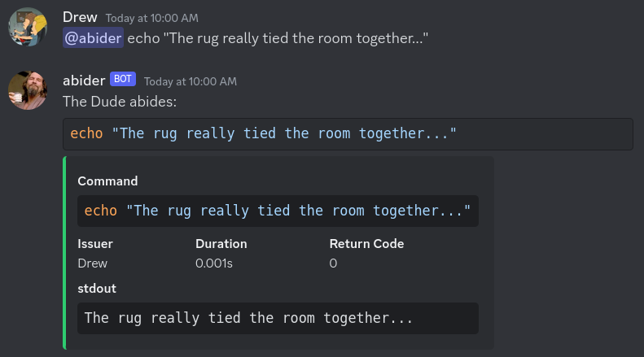
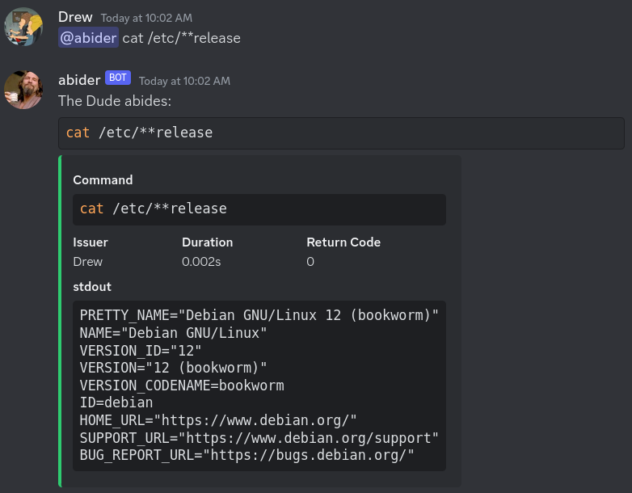
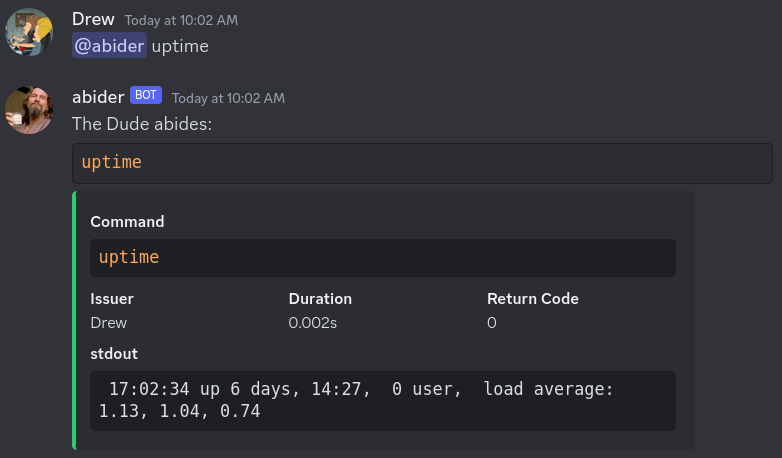
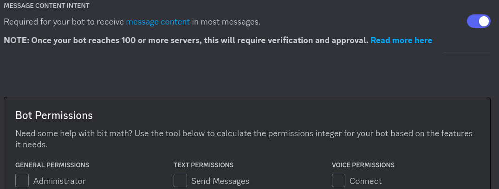

**Abider**

- [About](#about)
  - [Why](#why)
- [Bot Setup](#bot-setup)
  - [Discord](#discord)
- [Deploy](#deploy)
  - [Technical Info](#technical-info)
    - [Architectures](#architectures)
    - [Security](#security)
    - [Configuration](#configuration)
    - [Adding more packages/tools to the container](#adding-more-packagestools-to-the-container)
- [Other Stuff](#other-stuff)
  - [Dev](#dev)

---

## About

### Why

**Abider** is a _far out_ **Discord** bot.
It can be used by system administrators to have a little instance somewhere (a container, specifically), and to run shell commands from it.

It's packaged with **Debian** and **Alpine** containers, and a `docker-compose.yaml` and **Helm Chart**.

After the uh... what-have-you and before you go to the In-N-Out Burger, check it out:

## Bot Setup

### Discord

- See these links:
  - [https://discord.com/developers/applications](https://discord.com/developers/applications)
  - [https://discordpy.readthedocs.io/en/stable/discord.html](https://discordpy.readthedocs.io/en/stable/discord.html)
- There are no Bot Permissions required, but you will need to enabled [Message Content Intent](https://support-dev.discord.com/hc/en-us/articles/4404772028055)

## Deploy

- Images are offered in:
  - **Debian (Bookworm)** ([`ghcr.io/daemondude23/abider/debian:v0.1.0`](ghcr.io/daemondude23/abider/debian:v0.1.0))
  - **Alpine (3.18)** ([`ghcr.io/daemondude23/abider/alpine:v0.1.0`](ghcr.io/daemondude23/abider/alpine:v0.1.0)).
  - As always, never use the `latest` tag in production. There are more tags available.
- A **Kubernetes Helm Chart** is provided [in this repository](https://github.com/DaemonDude23/abider/tree/main/deploy/helm/charts/abider).
- A [`docker-compose.yml`](./deploy/docker-compose.yaml) file is available as well:
  

### Technical Info

#### Architectures

- The container is built with these linux architectures:
  - `linux/amd64`
  - `linux/arm64`

#### Security

- The container runs as a non-`root` user with UID/GID of `405`.
- All privileges are dropped.

#### Configuration

Configuration is done through _environment variables_ except the logging format, which is a _YAML_:

Environment Variable        | Default   | Type  | Description
----------------------------|-----------|-------|---------
`ABIDER_DISCORD_CHANNEL_ID` | `""`       | `str` | Required - Defines the Discord **Channel ID**.
`ABIDER_SUBPROCESS_TIMEOUT` | `"30"`     | `str` | Optional - Defines how long to wait before aborting command execution.
`ABIDER_DEBUGPY`            | N/A        | `str` | Optional - Set to "enabled" to use debugpy for remote debugging (along with a manually created image which contains that module).
`ABIDER_DEBUGPY_WAIT`       | N/A        | `str` | Optional - Set to "enabled" if using debugpy for remote debugging, this will wait for it to connect so you can debug initialization.
`ABIDER_WEEKDAY`            | N/A        | `str` | Optional - Set to "enabled" so the bot communicates more professionally and not at all Dude-like.

#### Adding more packages/tools to the container

- Modify the Dockerfiles here or here depending on your desired OS: [./src/Dockerfile-debian](./src/Dockerfile-debian).
  - By default, the `curl` package is added so just expand on that section of the file to suit your needs.

## Other Stuff

### Dev

See [./docs/dev.md](./docs/dev.md) for easy ways to set up a dev environment for contribution.
